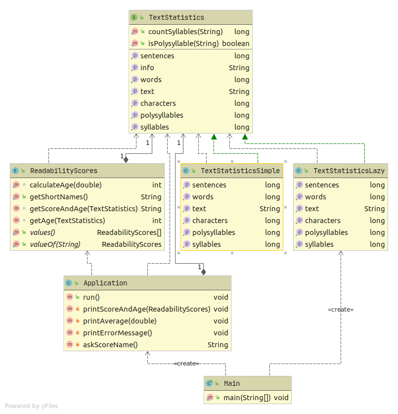

# JetBrains Academy. Project: Readability Score

## About

Everyone has their own personal reading history, and as we grow up, we are able to comprehend more and more complicated texts. But how do you estimate the level of difficulty of a given text, and how do you teach a computer to do that? In this project, you will find it out: write a program that determines how difficult the text is and for which age it is most suitable.

## Learning outcomes
Learn to call programs from the command-line and get more experience with using regexes and Math class.

## What you’ll do and what you’ll learn
- [Stage 1/4: Simplest estimation] Input a phrase or a sentence for the program to determine its difficulty level based on the symbol count. 
- [Stage 2/4: Words and sentences ] Apply your knowledge of advanced strings, arrays and regular expressions: determine how difficult the text is judging by the average count of words in the sentences. 
- [Stage 3/4: Score!] Add a readability score based on a special formula: it will estimate the difficulty levels of larger bodies of texts uploaded from a file. 
- [Stage 4/4: More parameters] More parameters can be taken into account: for example, you can consider syllables and letters. Enable the program to base its estimation on those parameters altogether. 

## Output example

```
java Main in.txt
The text is:
This is the front page of the Simple English Wikipedia. Wikipedias are places where people
work together to write encyclopedias in different languages. We use Simple English words
and grammar here. The Simple English Wikipedia is for everyone! That includes children and
adults who are learning English. There are 142,262 articles on the Simple English
Wikipedia. All of the pages are free to use. They have all been published under both the
Creative Commons License and the GNU Free Documentation License. You can help here! You
may change these pages and make new pages. Read the help pages and other good pages to
learn how to write pages here. If you need help, you may ask questions at Simple talk. Use
Basic English vocabulary and shorter sentences. This allows people to understand normally
complex terms or phrases.
 
Words: 137
Sentences: 14
Characters: 687
Syllables: 210
Polysyllables: 17
Enter the score you want to calculate (ARI, FK, SMOG, CL, all): all
 
Automated Readability Index: 7.08 (about 13 year olds).
Flesch–Kincaid readability tests: 6.31 (about 12 year olds).
Simple Measure of Gobbledygook: 9.42 (about 15 year olds).
Coleman–Liau index: 10.66 (about 17 year olds).
 
This text should be understood in average by 14.25 year olds.
```
## UML Diagrams


